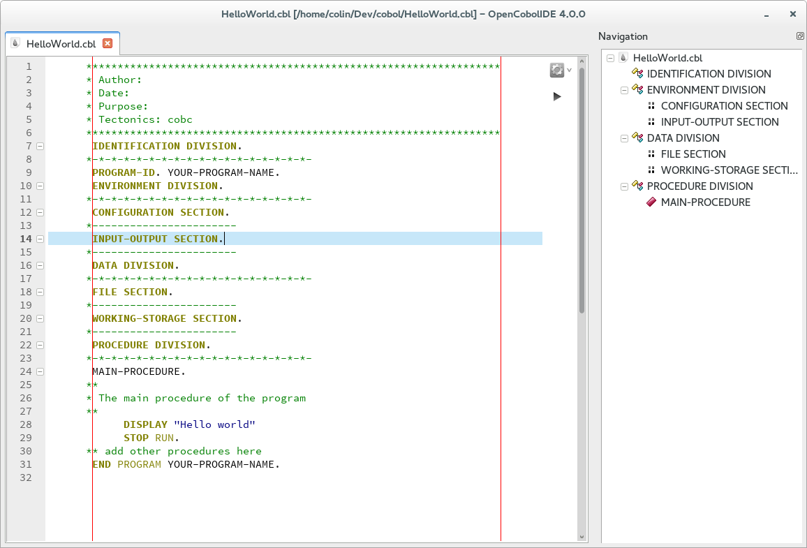
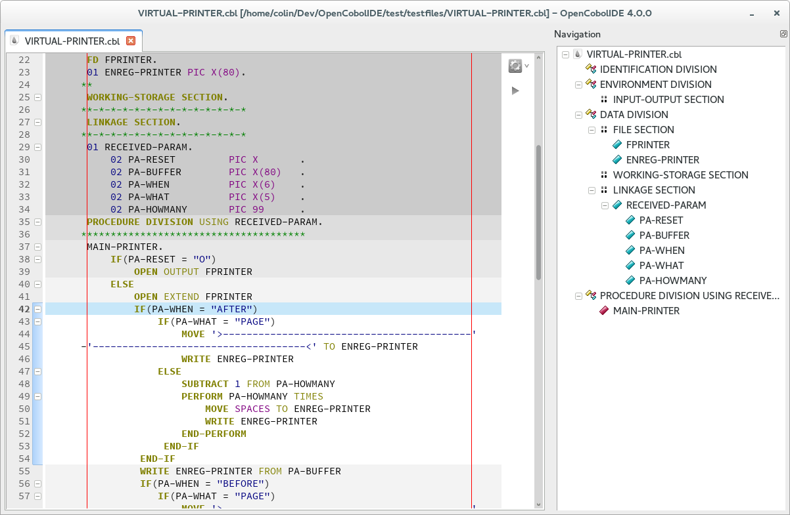

OpenCobolIDE
------------
.. image:: https://travis-ci.org/OpenCobolIDE/OpenCobolIDE.png?branch=master
    :target: https://travis-ci.org/OpenCobolIDE/OpenCobolIDE
    :alt: Travis-CI build status

.. image:: https://pypip.in/d/OpenCobolIDE/badge.png
    :target: https://crate.io/packages/OpenCobolIDE/
    :alt: Number of PyPI downloads

.. image:: https://pypip.in/v/OpenCobolIDE/badge.png
    :target: https://crate.io/packages/OpenCobolIDE/
    :alt: Latest PyPI version
    
.. image:: https://coveralls.io/repos/OpenCobolIDE/OpenCobolIDE/badge.png?branch=master     
   :target: https://coveralls.io/r/OpenCobolIDE/OpenCobolIDE?branch=master       
   :alt: Coverage Status                       

OpenCobolIDE is a simple and lightweight cobol IDE based on the GnuCobol
compiler.

The software is written in Python using `PyQt5`_ (or `PyQt4`_) and `pyQode`_

Features:
---------

- native (fast) cobol syntax highlighter
- cobol code completion
- cobol code folding
- navigable tree view of division, sections, paragraphs etc (fully synchronised
  with the code folding panel)
- smart auto indentation
- tool for computing PIC fields offsets
- compile as a program (.exe) or as a subprogram (.so/.dll)
- run the program from the editor or from a configurable external terminal (
  necessary if you are using the SCREEN section).
- dark color schemes and theme
- cross platform: works on **GNU/Linux**, **Windows** and **Mac OSX**

License
-------

OpenCobolIDE is released under the **GPL** version 3

Requirements
------------

- `GnuCobol`_
- `Python3`_
- `PyQt4`_ or `PyQt5`_
- `setuptools`_
- `pyqode.qt`_
- `pyqode.core`_
- `pyqode.cobol`_
- `Pygments`_
- `qdarkstyle`_

Installation
------------

GNU/Linux
#########

Install pyqt5, open-cobol and pip using your package manager, then run the following commands::

    sudo pip3 install OpenCobolIDE

If you are using Archlinux, you can install OpenCobolIDE and all its
dependencies from the AUR: https://aur.archlinux.org/packages/OpenCobolIDE/

Note that if you have both PyQt5 and PyQt4 on your system, the IDE will use
PyQt5 by default. To force the use of PyQt4, you should set the
``QT_API`` environment variable to ``pyqt4``.

Windows
#######

There is a windows installer available here: https://launchpad.net/cobcide/+download

Mac OSX
#######

There is a dmg image available here: https://launchpad.net/cobcide/+download

Before running the app, you first have to install the GnuCobol compiler, e.g.
using homebrew::

    brew install open-cobol

If you installed the compiler in a non-standard path and it is not recognized
by the IDE, you can specify the path to the compiler in the preferences
dialog under the ``Build & Run`` section (make sure to only specify the
directory where the compiler can be found, not the full path).

Resources
---------

-  `Downloads`_
-  `Source repository`_
-  `Issue tracker`_
-  `Documentation`_

Disclaimer
----------

I am by no way a cobol expert, I just had to work on a cobol project at school
with an awful IDE (NetExpress on a Windows Xp virtual machine). As I was writing
pyqode, I thought it would be nice to use it to make a simple cobol editor for
GNU/Linux.

I've only learnt COBOL 74 and the IDE has been designed with this standard in
mind. I don't plan to work with cobol at the moment nor to learn
a new standard but if you found a missing feature, feel free to open a feature
request. I'm always looking forward to make OpenCobolIDE better for the experts.

Your advice will be very appreciated!

Screenshots
-----------

* Home page:

.. image:: doc/source/_static/Home.png
    :align: center

* Editor:

.. image:: doc/source/_static/MainWindow.png
    :align: center

* Minimal view:

* Code folding:

* Offset calculator

.. image:: doc/source/_static/PicOffsets.png
    :align: center

* Dark style support

.. image:: doc/source/_static/Dark.png
    :align: center

.. _chardet: https://pypi.python.org/pypi/chardet
.. _PyQt4: http://www.riverbankcomputing.co.uk/software/pyqt/download
.. _Downloads: https://github.com/OpenCobolIDE/OpenCobolIDE/releases
.. _Source repository: https://github.com/OpenCobolIDE/OpenCobolIDE/
.. _Issue tracker: https://github.com/OpenCobolIDE/OpenCobolIDE/issues?state=open
.. _Documentation: http://opencobolide.readthedocs.org/en/latest/
.. _Pygments: http://pygments.org/
.. _pyqode.core: https://github.com/pyQode/pyqode.core/
.. _pyqode.cobol: https://github.com/pyQode/pyqode.cobol/
.. _pyqode.qt: https://github.com/pyQode/pyqode.qt/
.. _GnuCobol: http://sourceforge.net/projects/open-cobol/
.. _setuptools: https://pypi.python.org/pypi/setuptools
.. _Python3: http://python.org/
.. _PyQt5: http://www.riverbankcomputing.co.uk/software/pyqt/download
.. _qdarkstyle: https://github.com/ColinDuquesnoy/QDarkStyleSheet
.. _pyQode: https://github.com/pyQode/
