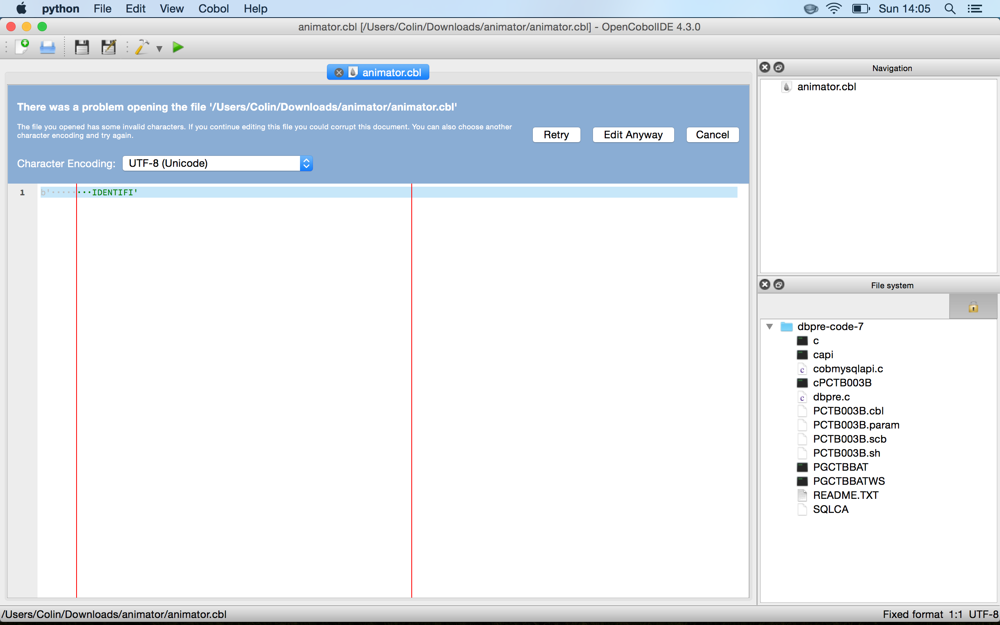
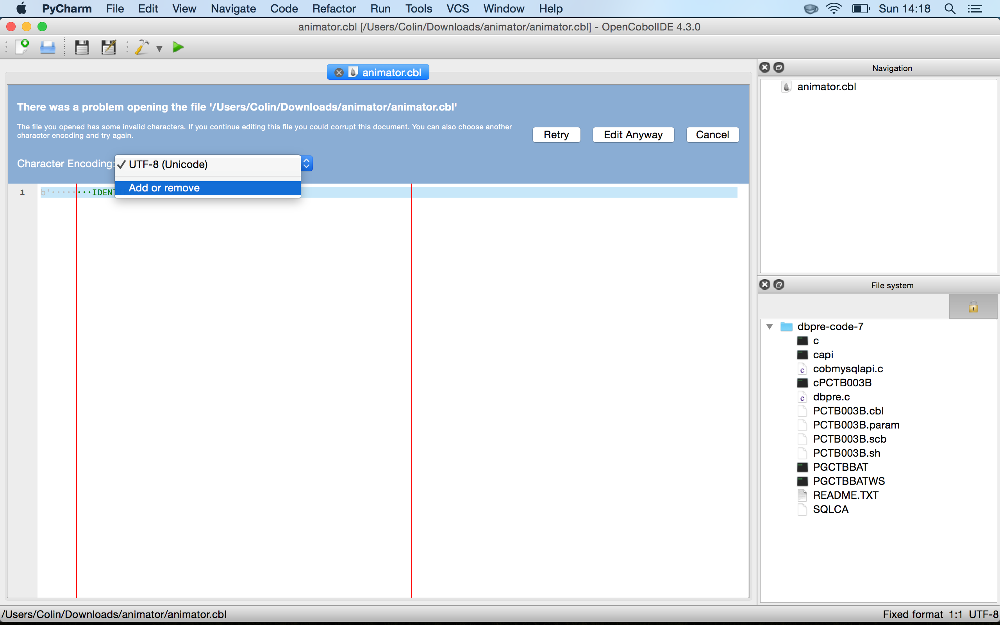
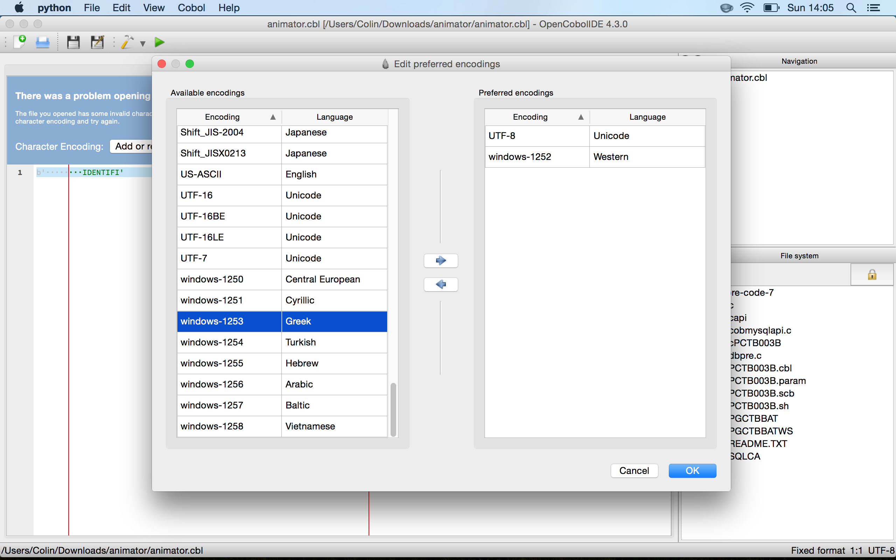

FAQ
===

1) Where are the generated binaries?
++++++++++++++++++++++++++++++++++++

The executable program or module can be found in the bin folder next to your
source file

2) I cannot compile on Windows. What can I do?
++++++++++++++++++++++++++++++++++++++++++++++

*(the compiler freeze or I get a execution error)*

First ensure that you do not have a conflicting installation of MinGW in your
PATH. If yes, remove it.

If the problem persists, do not hesitate to open an issue.

OpenCobolIDE is known to work on Windows (from Xp, to 8.1). Chances are that
the issue come from your configuration.

3) Cannot detect OpenCobol compiler on Mac OSX. What can I do?
++++++++++++++++++++++++++++++++++++++++++++++++++++++++++++++

If you installed the open cobol compiler in a non-standard path, you will have
to tell OpenCobolIDE where to look.

You can specify the path to the compiler in the preferences dialog
(Build & Run tab).

4) OpenCobolIDE failed to open a file due to an encoding issue. What can I do?
++++++++++++++++++++++++++++++++++++++++++++++++++++++++++++++++++++++++++++++

OpenCobolIDE does not detect file encoding automatically. It first tries with your
locale file encoding (e.g. UTF-8 on GNU/Linux and Mac OSX and whatever windows-XXX encoding
on Windows). If that fails, the editor will open with a blue panel at the top
asking you to select another encoding and retry:

1) You must choose another encoding from the character encoding combo box. This combo
   box contains your preferred file encodings. Usually there is only one entry in this list
   and you need to add a new file encoding to your preferred encodings. To do that, click
   on ``Add or remove``.

2) Add one or more file encodings from the ``Available encodings`` to your
   ``Preferred encodings`` and click on ``Ok``.

3) Select the encoding to use in the `Character encoding``combo box and click on ``Retry``

If you selected the correct encoding, the file should now load properly in the editor. If not, try
another encoding...
