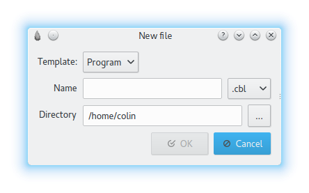
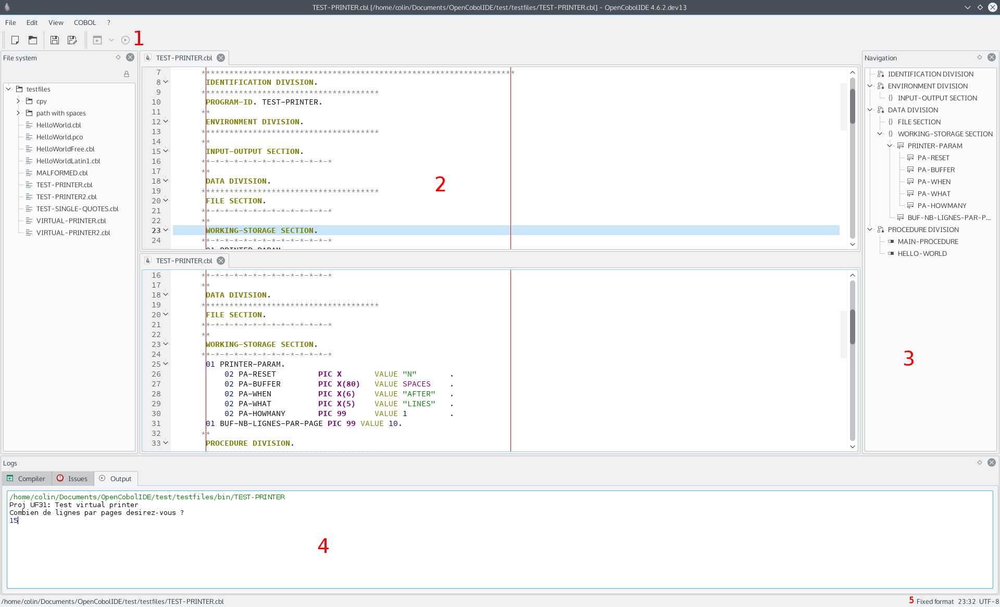

Getting started
===============
.. note:: All the screenshots were taken on Gnome 3 desktop.
          You will have different looks and feels on other operating systems or
          desktop environments.

OpenCobolIDE is **simple and lightweight** IDE. It works on a single
file basis (i.e. it has no concept of project): *you create/open a file,
compile it then run it.*

.. image:: _static/Home.png
    :align: center

This is the first window you will see when running OpenCobolIDE, called the
*home page*. From there you can create new files or open existing one.
You can also access the application menu by right clicking on any empty area.

Create a new file
-----------------

- click on *New*

- the following dialog should appear:

- fill up the following information:

    - Type:
        Specify the type of file to create. Depending on your choice the
        default code template that is created will changed. Note that you
        can changed the file type later on after creating the file.

        You can choose from:

            - program:
                A *program* is an **executable**.
                When compiled, it produces an **.exe** on Windows and an
                **executable binary file** on GNU/Linux and Mac OSX.

            - module:
                A *module* or *subprogram* is a **library**, a list of
                procedures that can be shared among other modules/programs.
                When compiled, it produces a dynamically linked library
                (**.dll**) on Windows and a shared object (**.so**) on
                GNU/Linux and Mac OSX.

            - empty:
                create an empty file.

    - Name:
        file name without extension (you can choose the extension in the
        drop down list)

    - Directory:
        directory where the file will be created.

.. warning:: The source code of a module must be located in the same directory
             as the calling program's source code to work properly.

Open a file
-----------

Simply click on *Open* or choose a file in the recent files list.

.. note:: The recent files list have a context menu that let you remove a file
          or clear the entire list.

The main window
---------------

Here is the main window of OpenCobolIDE:

It is made up of 5 distinct parts:

1. menu and toolbar zone:

    The menu contains all the actions that can be performed in the application.
    Note that the menu is hidden when you switch to the minimal perspective.
    In that case, you can show it by right clicking next to the last editor
    tab (in the empty area).

2. code editors tab widget:

    This is where you type your code.

3. the **Navigation** panel (movable and closable):

    This panel shows the document structure. It is fully synced with the code
    folding panel (inside the current editor).

4. the **Log** panel (movable and closable):

    This panel shows the list of errors found in your program and you program
    output.

    It is made up of the following tabs:

    - Issues: the list of issues
    - Output: the program output (when you run it).

        .. note:: The output console is interactive and accepts stdin but does
                  not support COBOL ``SCREEN SECTION``.
                  If you're using the screen section, you should run your
                  program in an external terminal *(Preferences->Build And
                  Run)*

5. the status bar:

    The status bar shows menu/actions description on the left and current editor
    information on the right (free/fixed format, cursor position,
    file encoding).

Compile a file
--------------

To compile a file, press **F8** or press the compile button.

This will compile the current file as well as its dependencies.

You can double click on an entry in the issues table to quickly go to the
problematic line in the editor (if the file hasn't been open,
OpenCobolIDE will gently open it for you).

To change the program type you must press the down arrow next to the compile
button. Doing this will reveal a drop down menu where you can choose the program
type:

Run a compiled program
----------------------

Press **F5** or click the run button (inside the editor) to run the file.

The program will run in the *Output* window which is interactive (support for
stdin has been tested and works with the **ACCEPT** keyword).

.. note:: It will recompile the file and all its dependencies before running
          the compiled program.
