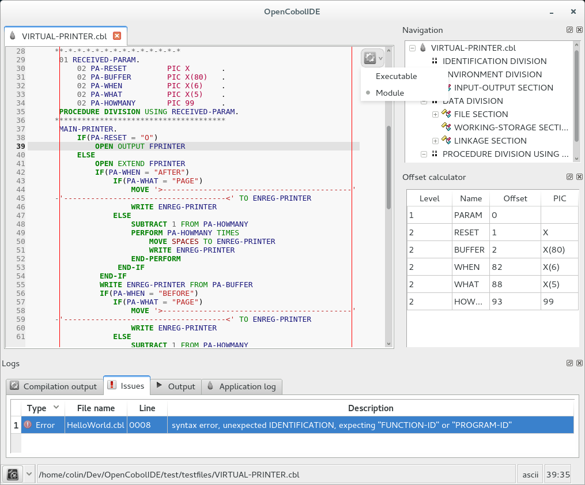
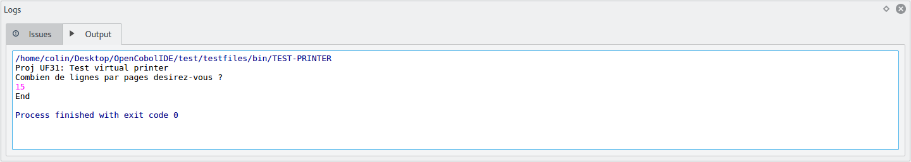

Getting started
===============

.. note:: All the screenshots were taken on Gnome 3 desktop.
          You will have different looks and feels on other OS/DE.

This is the first window you will see when running OpenCobolIDE. This is your
home page.

.. image:: _static/Home.png
    :align: center

From there you can create new files or open existing one. OpenCobolIDE is
**simple and lightweight** IDE. It works on a single file basis (i.e. it
has no concept of project):

    *You create/open a file, compile it then run it.*

Create a new file
-----------------

- click on *New*

- the following dialog should appear:

.. image:: _static/NewFile.png
    :align: center

- fill up the following information:

    - Type:
        Specify the type of file to create. You can choose from

            - program:
                A *program* is an **executable**.
                When compiled, it produces an **.exe** on Windows and an
                **executable binary file** on GNU/Linux and Mac OSX.

            - module:
                A *module* or *subprogram* is a **library**, a list of
                procedures that can be shared among other modules/programs.
                When compiled, it produces a dynamically linked library
                (**.dll**) on Windows and a shared object (**.so**) on
                GNU/Linux and Mac OSX.

            - empty:
                create an empty file.

        The type can be changed later. It used now to setup the default
        code skeleton, to simplify your life ;)

    - Name:
        file name without extension (you can choose the extension in the
        drop down list)

    - Directory:
        directory where the file will be created.

.. warning:: Modules source code must be in the same directory as the parent
             program source code to work properly.

Open a file
-----------

Simply click on *Open* or choose a file in the recent files list.

.. note:: The recent files list have a context menu that let you remove a file
          or clear the entire list.

The main window
---------------

Here is the main window of OpenCobolIDE:

.. image:: _static/MainWindow.png
    :align: center

It is made up of 4 important parts:

1) the text editor tabs:

    This is where you type your code.

2) the **navigation** panel (movable and closable):

    This panel show you the structure of your code and let you navigate
    quickly inside your document.

3) The **Log** panel (movable and closable):

    This panel show various log and output.

    It is made up of the following tabs:

    - Compilation output:
        textual output of the cobol compiler
    - Issues:
        the list of issues
    - Output:
        the program output (when you run it). The output console is
        interactive and accepts stdin.
    - Application log:
        the application log, for debugging purpose. This window is not
        visible when you start the IDE.
        You can show it by checking: `menu -> View -> Appplication log -> Show window`

4) the status bar:

Since version 2.4, the status bar has become an important part of the
application as it now contains the preferences button and the general menu
as a drop down menu button:

    .. image:: _static/Menu.png
        :align: center

You can click on the button to show the preferences dialog or click on the
arrow to reveal the general menu (Open, New, View, Help, ...).

Compile a file
--------------

To compile a file, press **F8** or press the compile button (inside the
editor). This will compile the current file but also the referenced modules.

The compiler output will automatically be shown:

.. image:: _static/CompilerOutput.png
    :align: center

You can double click on an entry in the issues table to quickly go to the
problematic line in the code editor (if the file hasn't been open,
OpenCobolIDE will gently open it for you).

To change the program type you must press the down arrow next to the compile
button. Doing this will reveal a drop down menu that let you choose the program
type:

Run a compiled program
----------------------

Press **F5** or click the run button (inside the editor) to run the file.

The program will run in the *Output* window which is interactive (support for
stdin has been tested and works with the **ACCEPT** keyword).

.. note:: It will recompile the file and all its dependencies before running
          the compiled program.

Calculate the offset of a selected record
-----------------------------------------

Since version 2.2, you can now calculate the offset of a selected record.

- select the text that contains the record you're interested in,
- right click on the editor to open the context menu
- click *Calculate PIC offsets*.
- a new side panel will open and will show you a table with the offset of
  each selected record:

.. image:: _static/PicOffsets.png
    :align: center

Switching to a full dark style
------------------------------

Since version 2.2, OpenCobolIDE comes with a dark style sheet.

To activate it, open the preferences dialog (edit->preferences). Then go to the
style page and click on the *Dark style* radio button.

.. image:: _static/Settings.png
    :align: center

Your IDE shoul look like that:

.. image:: _static/Dark.png
    :align: center
