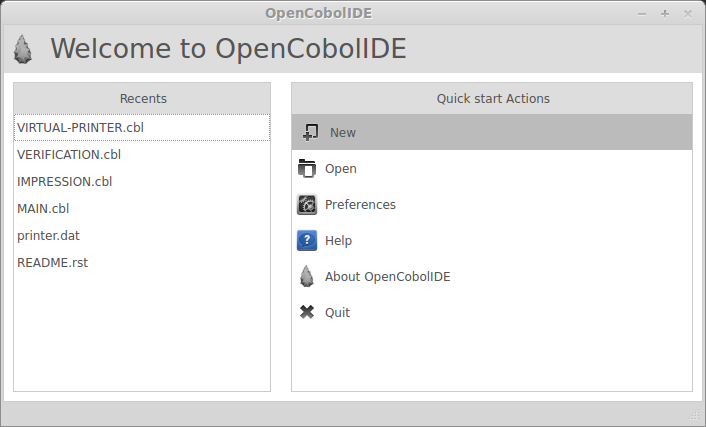
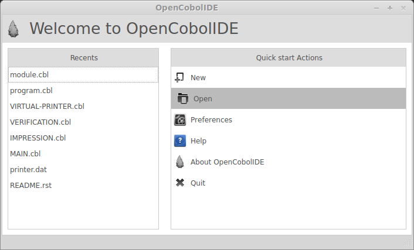
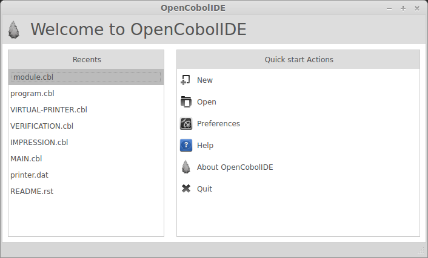
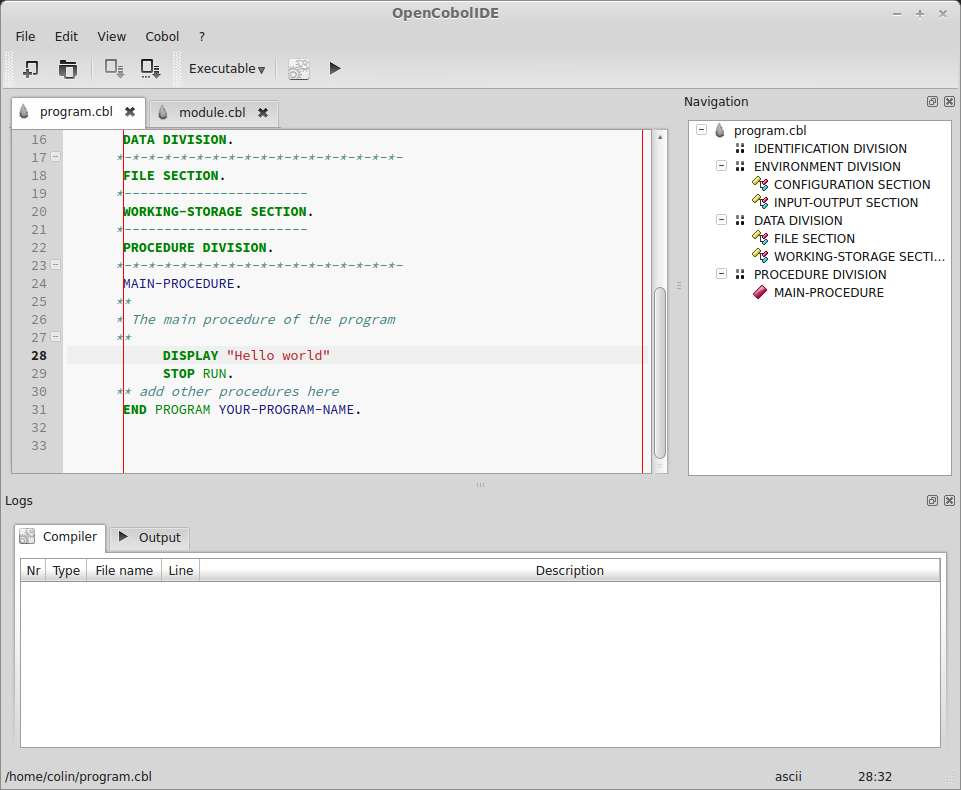
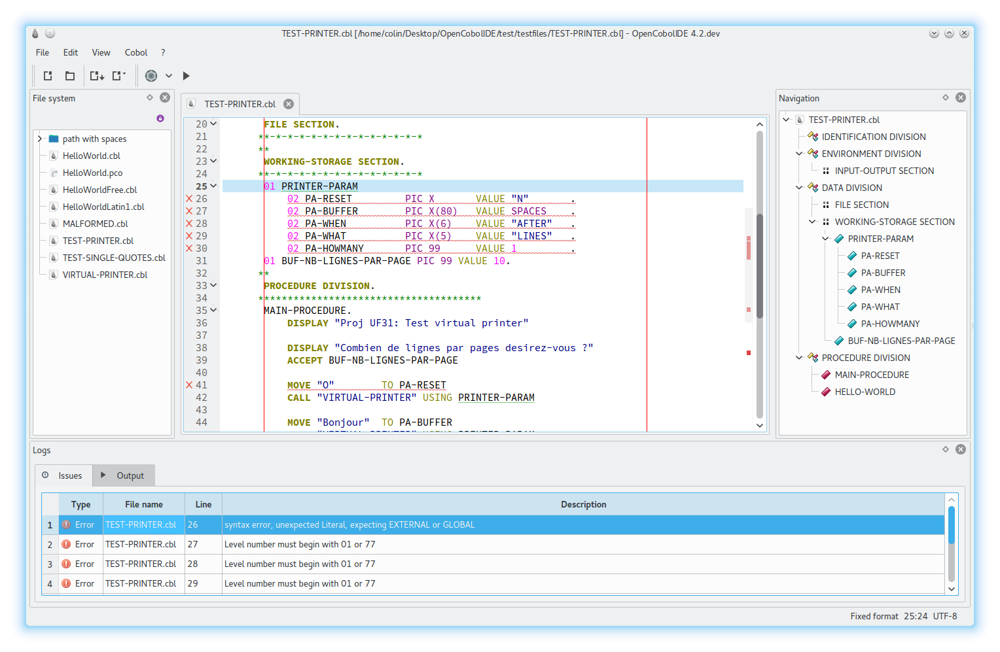
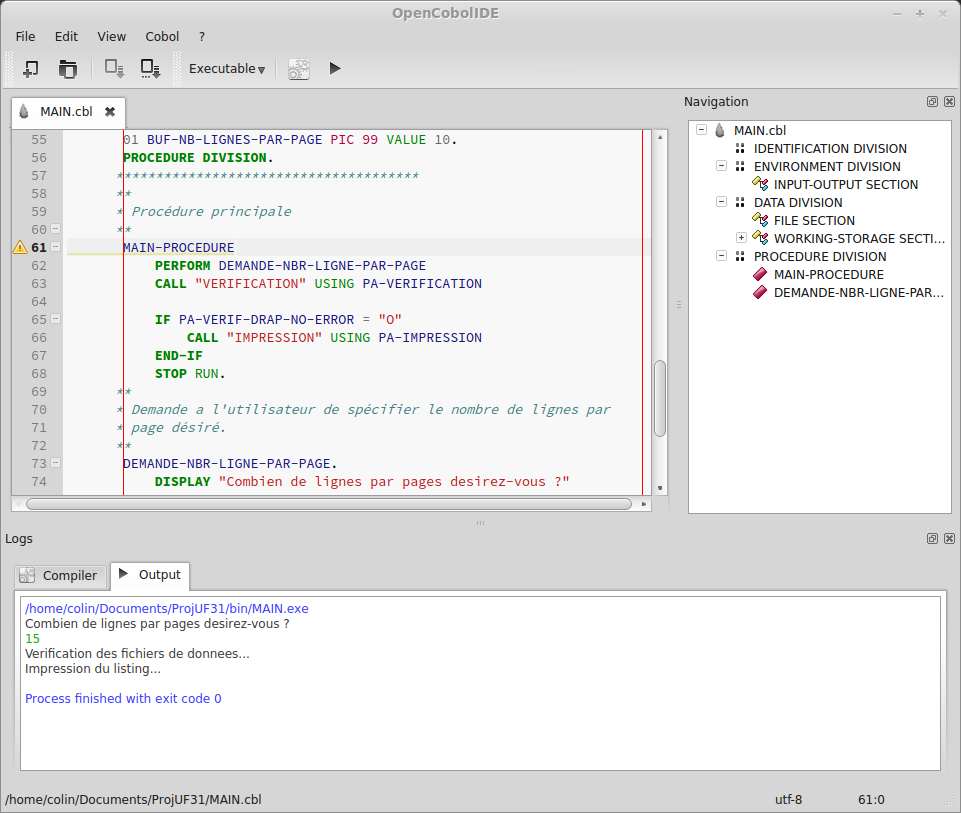
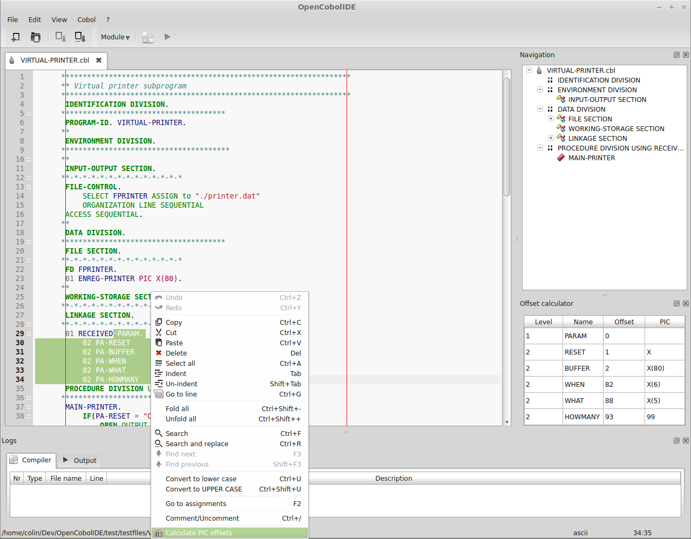
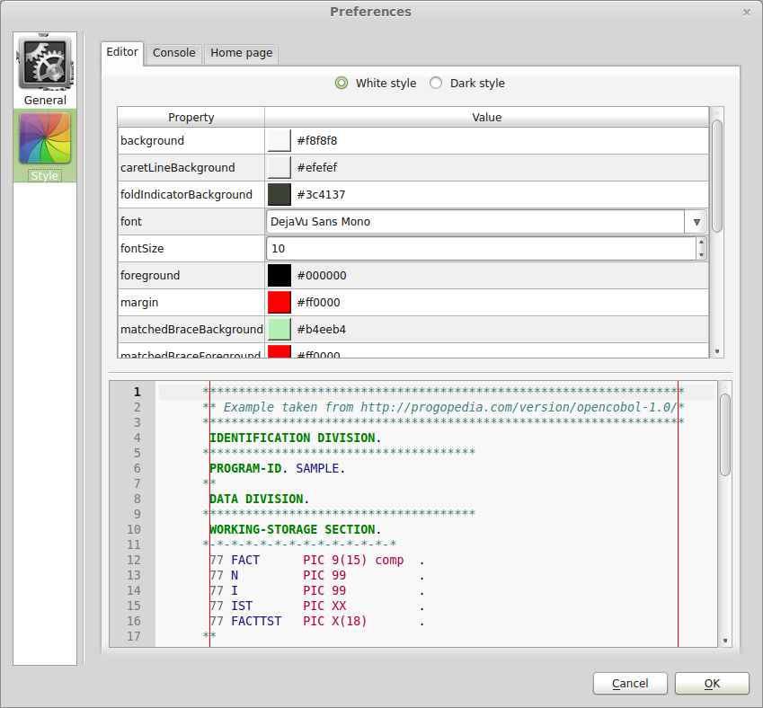
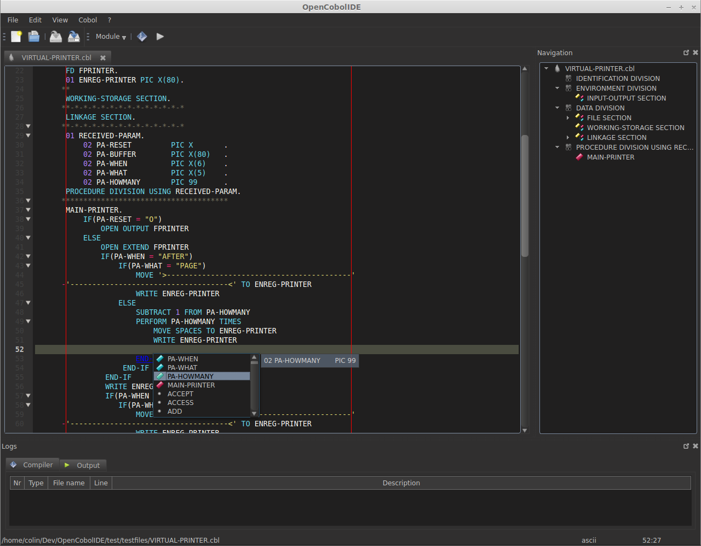

Getting started
===============
.. note:: All the screenshots were taken on Linux Mint 15. You will have a
          different look and feel on other OS/DE.

.. image:: _static/Home.png
    :align: center

This is the first window you will see when running OpenCobolIDE. This is your
home page. From there you can fire a quick start action to open or create a
cobol source file. You can also view an quickly open the recent documents you
recently worked on.

OpenCobolIDE is simple and lightweight IDE. It works on a single file basis (
i.e. it has no concept of project):

    You **create/open** a file, **compile** it then **run** it.

.. contents:: :local:

Create a new file
-----------------

Click on *New* in the *Quick start Actions* list:

The following Dialog should appear:

.. image:: _static/NewFile.png
    :align: center

Fill up the following information:

Type
++++

OpenCobolIDE makes the distinction between a Program and a
subprogram, called a Module.

A **Program** is an executable program. When compiled, it produces a **.exe** on
Windows and an **executable binary file** on GNU/Linux.

A **Module** or subprogram is a **library**, a procedure that can be shared
among other modules/program.
When compiled, it produces a dynamically linked library (**.dll**) on Windows
and a shared object (**.so**) on GNU/Linux.

When you create a new file you have can choose one of the 3 following options:

    - **program**: create a .CBL or .COB file with the default structure needed
      for an executable program, a hello world example.

      .. image:: _static/NewProgram.png
          :align: center

    - **module**: create a .CBL or .COB file with the default structure needed
      for a sub program. It will setup a basic linkage section.

      .. image:: _static/NewModule.png
          :align: center

    - **empty**: create an empty .CBL or .COB

.. warning:: Modules source code must be in the same directory as the parent
             program source code.

Name
++++

Choose the file name and extension (.cbl/.CBL, .cob/.COB, .pco/.PCO, .cpy/.CPY)

Directory
+++++++++

Choose the location of the new file.

Open a file
-----------

You can browse the file system to open a new file, for that click on *Open* in
the *Quick start Actions* list:

Or open a file you've recently worked on in the *Recents* list:

.. note:: OpenCobolIDE will parse your code looking for the usage/declaration of a
          linkage section to detect the cobol file type (program/subprogram).

          You can change the type to use to compile the file later by going to
          *Menu->Cobol->Program Type* or by using the combo box in the toolbar.

The main window
---------------

Here is the main window of OpenCobolIDE:

It is made up of 3 important parts (omitting the menubar and the toolbar):

  1) The text editors organized in a tab widget.

     .. tip:: You can close an editor tab using mouse wheel click. You can also
              right click on the tab bar for more options.

  2) The **Navigation** panel layout windows (movable and closable).

     .. tip:: Clicking on an item in the tree will move the cursor to the
              definition in the current editor.

  3) The **Log** panel (movable and closable) made up of the following
     tabs:

        - Compiler: compilier (cobc) output are organized in a sortable
          table.

        - Program output: An interactive output console.

Compile a file
--------------

To compile a file, press **F8**. This will compile the current file but also the
referenced modules.

The compiler output will be automatically show:

You can double click on an entry to quickly go to the problematic line in the
code editor. (if the file hasn't been open, OpenCobolIDE will gently open it for
you).

Run a compiled program
----------------------

Press **F5** to run the last compiled program.

The program will be run in the Output window which is interactive (support for
stdin has been tested and works with the **ACCEPT** keyword).

.. note:: It will not recompile the program. If you really need it, open a feature
          request on the issue tracker on github.

Calculate the offset of a selected record
-----------------------------------------

Since version 2.2, you can now calculate the offset of a selected record.

- select the text that contains the record you're interested in,
- right click on the editor to open the context menu
- click *Calculate PIC offsets*.
- a new side panel will open and will show you a table with the offset of
  each selected record:

Switching to a full dark style
------------------------------

Since version 2.2, OpenCobolIDE comes with a dark style sheet.

To activate it, open the preferences dialog (edit->preferences). Then go to the
style page and click on the *Dark style* radio button.

Your IDE shoul look like that:

