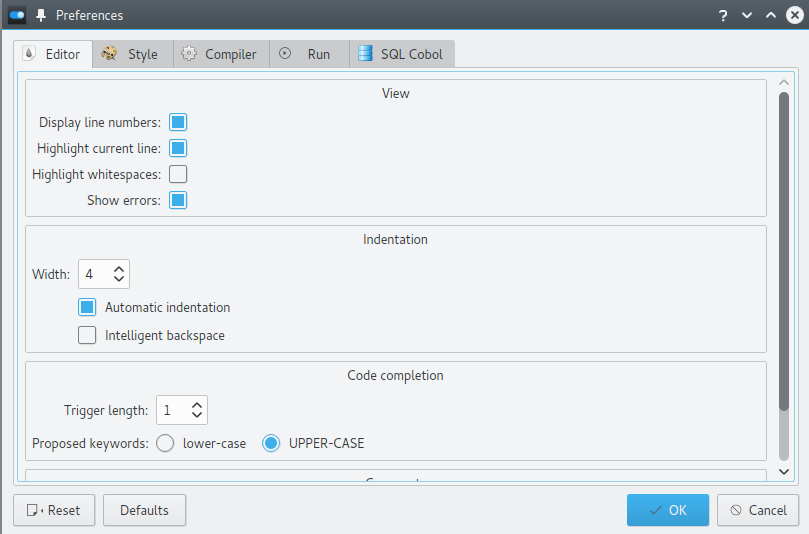
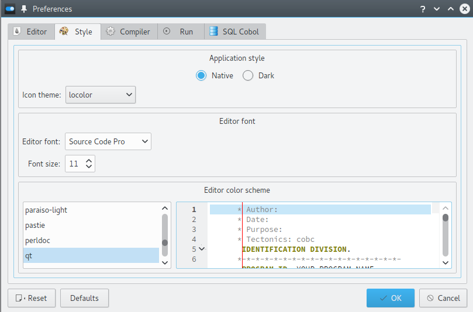
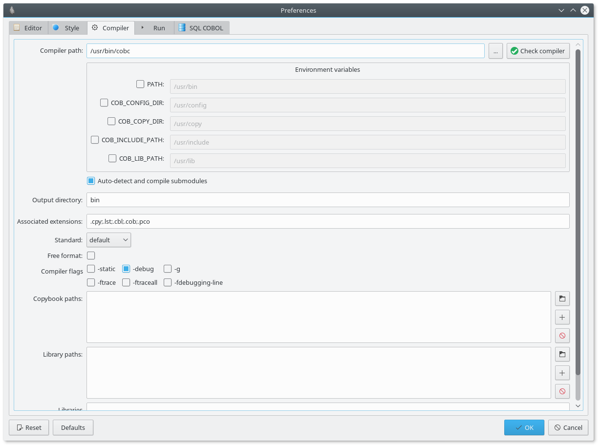
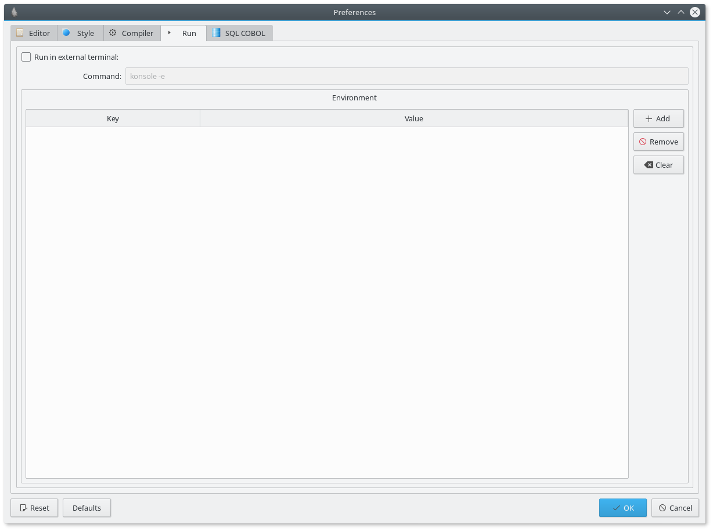
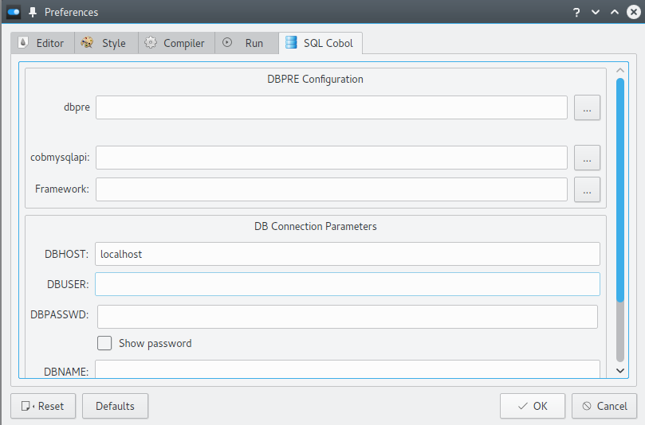

Application preferences
=======================

This page describes the preferences settings that are available for you to
customise your experience with the IDE.

To open the preferences dialog, go to Edit->Preferences (``F2`` on Windows and Linux and ``CMD+,`` on OS X).

Editor settings
---------------

This tab let you change the cobol source code editor settings.

View options:
+++++++++++++

- **Display line numbers**: show/hide the line numbers panel on the left of the editor
- **Highlight current line**: enable/disable highlighting of the current line
- **Highlight whitespaces**: show/hide visual whitespaces
- **Show errors**: enable/disable cobol linter (errors appears as red lines in the editor and as icons on the left of
                   the editor).
- **Show cursor position in bytes**: show cursor in position in bytes (take encoding into account) if enabled, otherwise show the column number.

Margins
+++++++

You can configure up to 4 different margins. You can choose the column where the
margin should appear and its color. Use 0 to hide a margin.

Comments symbol
+++++++++++++++

Choose the comment symbol you want to use for the comment/uncomment action (Ctrl+/).

Default is ``*> `` which should work with both fixed format and free format.

If you're using fixed format, you can set it to ``*``.

Indentation otions:
+++++++++++++++++++

- **Width**: the number of spaces for a tabulation
- **Automatic indentation**: enable/disable automatic *smart* indentation. The editor will move the cursor to the
  correct indentation level when you press ENTER (e.g. it will indent automatically after an if statement and so on.
- **Intelligent backspace**: If enabled, backspace will de-indent (eat at most ``Width`` spaces).

Code completion options:
++++++++++++++++++++++++

- **Filter mode**: choose how code completions should be filtered. You can choose between Prefix or subsequence. Subsequence might lead to better results but is much slower.
- **Trigger length**: specify the amount of characters needed to automatically trigger a code completion request.
  A value of 1 make the code completion trigger automatically as soon as you type.
- **Proposed keywords**: let you choose a convention for the cobol keywords: lower-case or UPPER-CASE keywords

EOL  options:
+++++++++++++

This group let you change how line endings are handled by the editor.

- Preferred EOL: Specify you preferred EOL, this EOL will be used for creating/saving files
- Auto-detect EOL: If checked, the editor will try to auto detect and keep the original line ending. If false, the
  preferred EOL will be used instead of the original line ending when you save a file.

Style settings
--------------

This tab let you change the appearance of the cobol editor and the interface.

Application style options
+++++++++++++++++++++++++

This group of settings let you change the appearance of the interface. You can either choose to use
the **Native** theme (the app will look similar to the native apps of your system) or use a **Dark** stylesheet.

On GNU/Linux, you can also choose a custom **icon theme**.

Editor font options
+++++++++++++++++++

This group of settings let you change the code editor font settings (font name and default size).

Editor color scheme
+++++++++++++++++++

This let you choose a color scheme for the source code editor and the run output window.

OpenCobolIDE uses the pygments library for its color schemes definition. You can easily add some
custom color schemes by installing python plugin (this won't work with a frozen application on Windows and OS X).

Compiler settings
-----------------

This tab let you change the GnuCOBOL compiler settings.

.. warning:: Those settings are applied globally to every file you compile with the IDE. At the moment there is no way
             to set custom compiler settings per file.

.. note:: These settings don't support environment variable expansion.

Compiler path
+++++++++++++

This option let you specify the full path to a working GnuCOBOL compiler. When you change this path you can
check whether your compiler is working by clicking on the "Check compiler" button. The following dialog will then
show up.

Press "Check compilation" to check if the compiler is able to compile a simple hello world executable. If you don't
get "Compiler works", read the compiler output carefully. If it is not working, you might need to adjust the
environment variables.

- PATH: prefix paths to the PATH environment variable
- COB_CONFIG_DIR: Hmm, news says this was dropped, but it’ll effect where .conf dialect support files are found.
- COB_COPY_DIR: Path to COPY books.
- COB_INCLUDE_PATH
- COB_LIB_PATH

**Auto-detect and compile submodules** checkbox let you choose whether you'd like the IDE to
compile submodules automatically (that way you just have to compile your main modules).

.. note:: Each environment variables has an associated checkbox, it won't be used unless the check box is checked.

Output directory
++++++++++++++++

This option let you chose where to put the binaries, by default binaries will be placed into a *bin* folder next
to the source file. You can define another relative or absolute directory if you want.

Associated extensions
+++++++++++++++++++++

Associate custom extension with the GnuCOBOL compiler. Extensions should be dotted (.cbl) and lowercase. The uppercase
version will be handled by the ide automatically.

Standard
++++++++

This option let you choose the target COBOL standard.

Free format
+++++++++++

Enable/Disable coding in free format.

Compiler flags
++++++++++++++

This let you change some common C compiler settings. Every checkbox has a tooltip that describes what the setting is
used for.

There is a line edit widget where you can add additional missing compiler flags (separate them with a blank space).

Copybook paths
++++++++++++++

This option let you add custom copybook paths, e.g. to locate a COBOL copybook you're including in your program.

Library paths
+++++++++++++

This option let you add custom library paths, e.g. to locate a c library that you need to link with (such as
mysqlclient). *-L flag*

Libraries
+++++++++

This option let you specify the libraries you want to link with. Separate them with a blank space. *-l flag*

VCVARSALL path:
+++++++++++++++

*This option is not visible on the above screenshot because it is available only on windows.*

This option let you specify the path to vcvarsall.bat which is needed if you are using a custom GnuCompiler built with
Visual Studio. ``vcvarsall.bat`` can be found in the ``VC`` folder of your Visual C++ installation.

Run settings
------------

.. note:: These settings don't support environment variable expansion.

External terminal
+++++++++++++++++

This tab let you change the way the IDE run executable programs.

By default the program will run inside the IDE, in the program output window.
This work nice for basic program but will fail as soon as you start using the ``SCREEN-SECTION``,
an error message about being unable to redirect output will appear in the program output.

To run such a program you need to run it in an external console window.

To enable running a program in an external terminal:

* check ``Run in external terminal``
* specify the terminal program to use if necessary:

    * **On Windows**, the IDE will automatically use ``cmd.exe``.
    * **On OS X**, the IDE will automatically use ``open``.
    * **On linux**, it depends on the distribution and the desktop environment you are using.
      The IDE will try to pick up one of those if available: ``gnome-terminal``, ``konsole`` and ``xfce-terminal``.
      If you are using another terminal, please indicate the command to use.

Environment
+++++++++++

Here you can define some additional environment variables that you'd need to
run your program.

Quoting Simon Sobisch (the lead of the GnuCOBOL project)::

    Users with (recent) GnuCOBOL 2.x can set COB_RUNTIME_CONFIG (
    see the documentation or conf/runtime.cfg) to have all settings
    they need in one place - both for use with and without OCIDE.

    Use multiple configuration files (one "master" and the others only
    setting necessary "special" flags and include master.cfg) and you
    have a different set of runtime configurations by just one change in
    OCIDE :-)

SQL Cobol settings
------------------

This tab let you configure `dbpre`_ integration to get mysql support with COBOL!

.. warning:: This has been tested and validated on Linux only.

DBPRE Configuration
+++++++++++++++++++

It's up to you to install and setup dbpre. Once done, you can configure integration with the IDE.

This group of settings let you specify where to find the various parts of the dbpre framework:

- **dbpre**: location of the dbpre executable
- **cobmysqlapi**: location of the cobmysqlapi object file.
- **Framework**: path to the directory that contains the cobol copybooks that are needed to compile and run your sql cobol
  program

DB Connection Parameters
++++++++++++++++++++++++

This group of settings let you specify the content of the .param file that will be generated after the
compilation of your program succeeded. This file contains database connection settins. Read the dbpre documentation
to get more info!

.. _dbpre: http://sourceforge.net/projects/dbpre/
