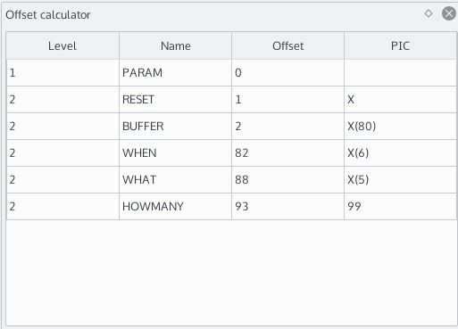
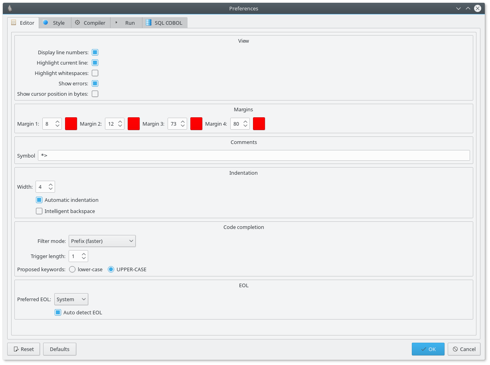
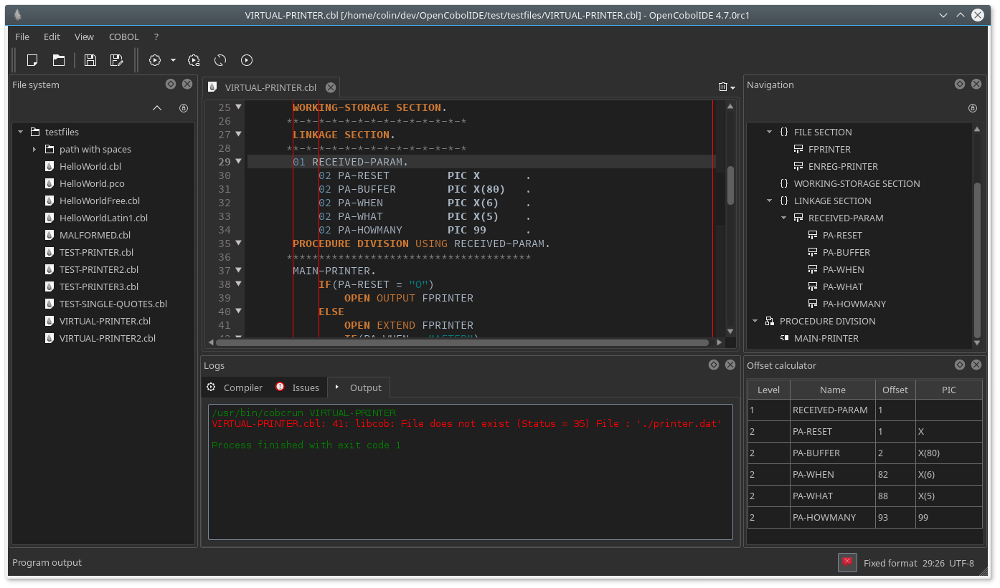
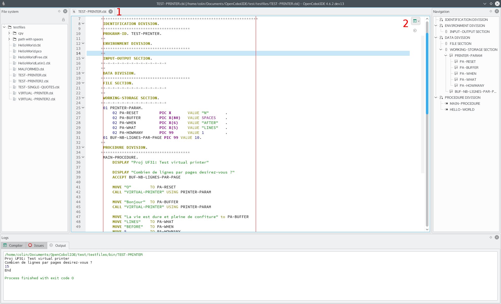

Tips and tricks
===============

Calculate the offset of a selected record
-----------------------------------------

Since version 2.2, you can now calculate the offset of a selected record.

- select the text that contains the record you're interested in,
- right click on the editor to open the context menu
- click *Calculate PIC offsets*.
- a new side panel will open and will show you a table with the offset of
  each selected record:

Switching to a full dark style
------------------------------

Since version 2.2, OpenCobolIDE comes with a dark style sheet.

To activate it, open the preferences dialog (Edit->Preferences). Then go to the
*Style* page and click on the *Dark* radio button.

Your IDE should look like that:

.. note:: Switching the dark style on will change the editor color scheme.

.. note:: Since v4.0, you can also change the icon them on linux.

Switching between classic view and minimal view
------------------------------------------------

Version 4.0 allow you to switch between a classic view (where the menu and
toolbars are visible) to a minimal view by double clicking on an editor tab.

The minimal view looks like that:

To access the application menu, just click next to the last open editor (1).
To compile and run the file, use the buttons located inside the editor widget
(2).

Splitting an editor
-------------------

Starting from version 4.2, you can split an editor vertically or horizontally.

To do that, right click on the editor tab you want to split and select Split->Horizontally
or Split->Vertically.